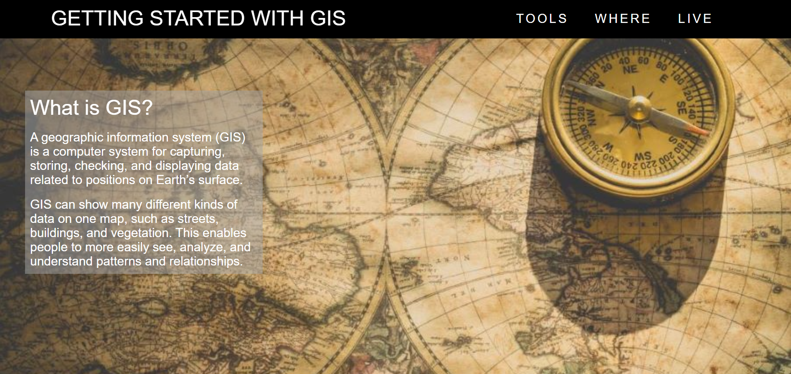
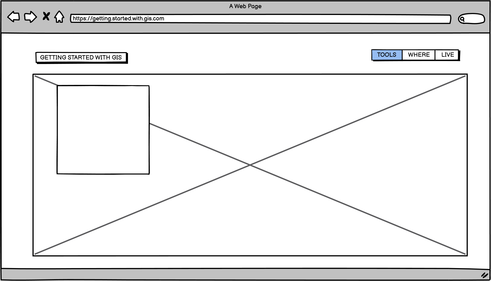
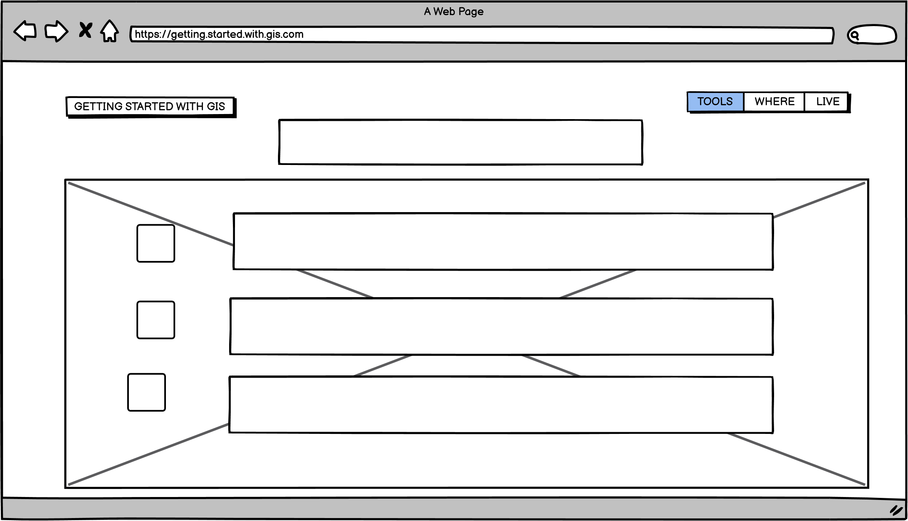
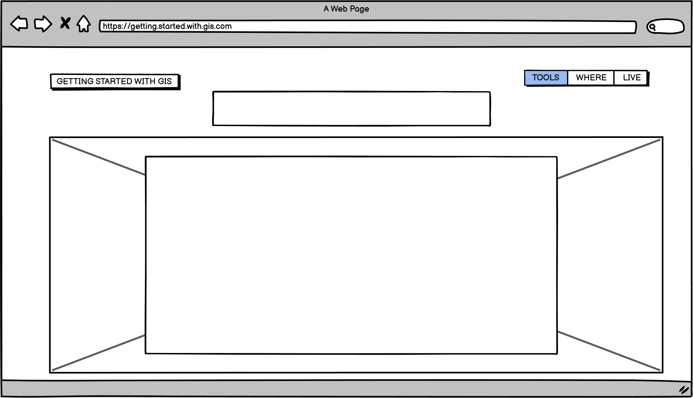
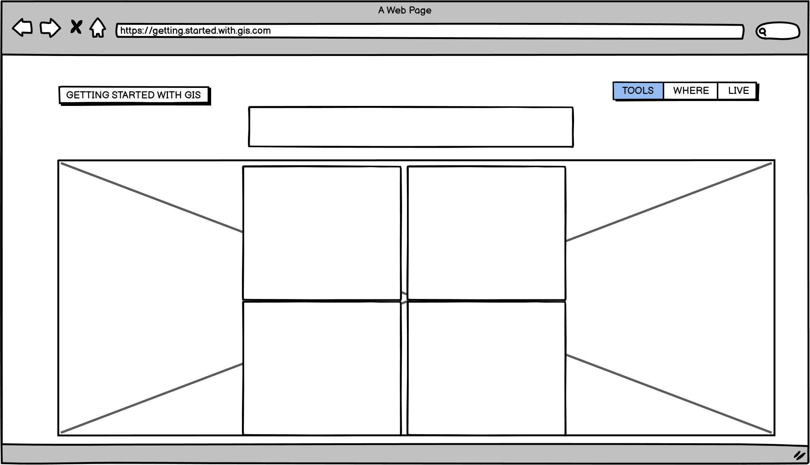
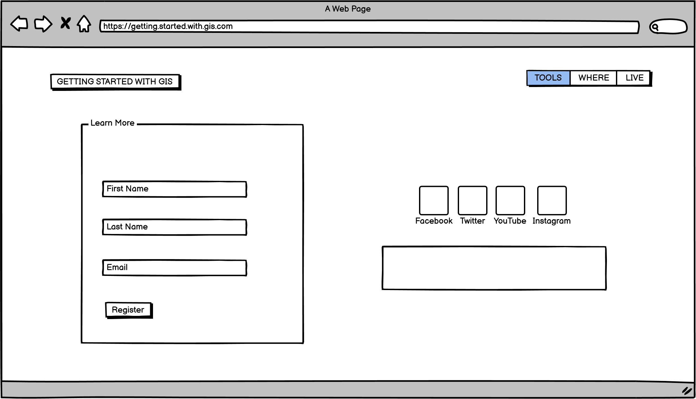
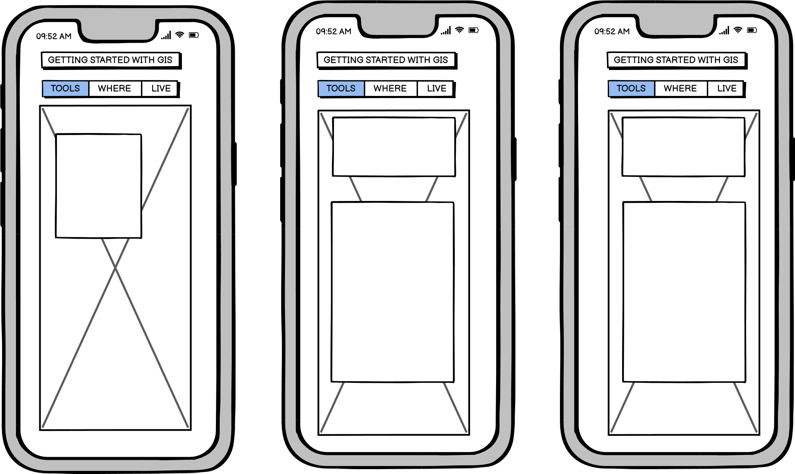
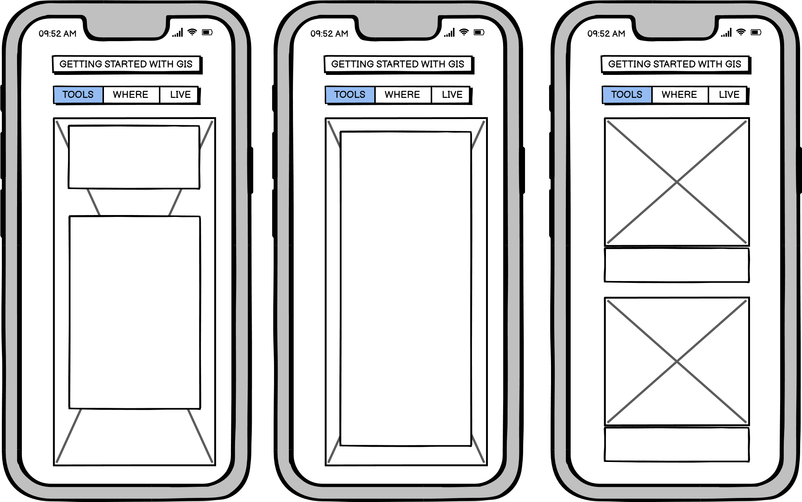

# GETTING STARTED WITH GIS 

## Description: Code Institute Student Project: 

A website targeted to user’s who are interested in Geographic Information Systems (from here on known as GIS). 
It showcases my HTML and CSS ability.

A live website can be found [here](https://kevinfaaa.github.io/kevs-portfolio-project-1-DRAFT/).

# Table of Contents
- [1. Introduction](#introduction)
- [2. Testing](#testing)
- [3. Bugs](#bugs)
- [4. Future Updates](#future-updates)
- [5. Contribution Links](#contribution-links)
- [6. Deployment](#deployment)
- [7. Wireframe](#wireframe)

# 1. Introduction
[Go to the top](#table-of-contents)

This is the first website I created and is part of my project portfolio required in the Full-Stack Software Development Diploma I am currently undertaking.
The aim of the website is to show and inform users of the following:
-	The website should explain with GIS.
-	The website should identify commonly used tools to build a GIS.
-	The website should give examples of industries where GIS can be applied, to improve it.
-	The website should provide links to interesting live GIS viewers to demonstrate what can be achieved within a GIS and to provide the user with food for thought.

## How to use
The website can be operated by the following:
###	Header 
The header is a sticky navigation bar which can bring the user to four core sections of the website.
####	Core sections
The four core section are made up of the following:
-	An introduction explaining what GIS is.
-	The “GIS Tools” section has clickable links to varies GIS tools home webpages to show the user some of the tools required to build a GIS. A paragraph beside the link explains what the tool can achieve.
-	The “Where GIS Works” section explains to the user what industry sectors GIS can have a positive impact on when incorporated. 
-	The “Live Maps” section has four clickable links to four different live viewers which gives the user a taste of what possible with GIS.
 
###	Footer
The footer is comprised of two sections:
-	A form section is created to allow the user to register his/her name and email address to receive additional GIS related topics to browse and learn from.
-	The second section in the footer contains links to the following social media websites:
1. Facebook
2. Twitter
3. YouTube
4. Instagram

Below the social media links is a copyright notice

# 2.	Testing

[Go to the top](#table-of-contents)

## Google Develop Tools
For each HTML section I created and used CSS to style I would save it and see how it looked in the browser window. I used Google Developer Tools to test bug fixes on the fly.
Google Developer Tools was really important when making the website responsive as it easily allowed me to view the website at different media screen sizes. 

##	The W3C Markup validation Service

I used [W3C Markup Validator](https://validator.w3.org/#validate_by_input+with_options) to check for any errors within my HTML page.

### Errors Found:

1. Error: Element li not allowed as child of element div in this context. (Suppressing further errors from this subtree.)
- From line 103, column 13; to line 103, column 16.
- Error fixed.

2. Error: Element li not allowed as child of element div in this context. (Suppressing further errors from this subtree.)
- From line 104, column 13; to line 104, column 16.
- Error fixed.

3. Error: Element li not allowed as child of element div in this context. (Suppressing further errors from this subtree.)
- From line 105, column 13; to line 105, column 16.
- Error fixed.

4. Error: No p element in scope but a p end tag seen.
- From line 108, column 13; to line 108, column 16
- Error fixed.

5. Error: End tag section seen, but there were open elements.
- From line 159, column 5; to line 159, column 14
- Error fixed.

6. Error: Unclosed element div.
- From line 158, column 9; to line 158, column 13
- Error fixed.

7. Error: Unclosed element div.
- From line 77, column 9; to line 77, column 24
- Error fixed.

### Warnings Found:

1. Warning:  Section lacks heading. Consider using h2-h6 elements to add identifying headings to all sections.
- From line 46, column 9; to line 46, column 35.
- Warning not fixed.

##	The W3C CSS validation Service

I used [W3C CSS Validator](https://jigsaw.w3.org/css-validator/#validate_by_input) to check for any errors within my CSS page.

### Errors Found:

1. 178 - #qgis img - Value Error : margin center is not a margin value : 0 center
- Error fixed.
2. 186 - #qgis a - Value Error : margin center is not a margin value : 0 center
- Error fixed.
3. 201 - #fme img - Value Error : margin center is not a margin value : 0 center
- Error fixed.
4. 208 - #fme a - Value Error : margin center is not a margin value : 0 center
- Error fixed.
5. 223 - #arcgis img - Value Error : margin center is not a margin value : 0 center
- Error fixed.
6. 230 - #arcgis a - Value Error : margin center is not a margin value : 0 center
- Error not fixed.
7. 484 - .form-section, .social - Value Error : float clear is not a float value : clear
- Error fixed.

### Warnings Found:

1. 335	#left-g a - Same color for background-color and border-top-color
- Warning not fixed.
2. 335	#left-g a - Same color for background-color and border-right-color
- Warning not fixed.
3. 335	#left-g a - Same color for background-color and border-bottom-color
- Warning not fixed.
4. 335	#left-g a - Same color for background-color and border-left-color
- Warning not fixed.
5. 352	#right-g a - Same color for background-color and border-top-color
- Warning not fixed.
6. 352	#right-g a - Same color for background-color and border-right-color
- Warning not fixed.
7. 352	#right-g a - Same color for background-color and border-bottom-color
- Warning not fixed.
8. 352	#right-g a - Same color for background-color and border-left-color
- Warning not fixed.

##	Am I responsive?

I used [Am I Responsive](http://ami.responsivedesign.is/) to view how my website is displayed on different media viewports. The results suggust that the webisite is responsive for the follwoing devices:
- Widescreen desktop.
- Laptop.
- Ipad.
- Mobile Phone.

It must be noted that this website is targeted at mobile (iPhone X width 375px), desktop (width 1800px) and laptops (width 1350px) media screens. 

##	Manual Testing

### Navigation Bar
#### GETTING STARTED WITH GIS
- When “GETTING STARTED WITH GIS” is left clicked with the mouse, the browser sends the user to the start of the website. It worked as expected.
#### Tools
- When “Tools” is left clicked with the mouse, the browser sends the user to the "GIS Tools" section of the website. It worked as expected.
#### Where
- When “Where” is left clicked with the mouse, the browser sends the user to the "Where GIS Works" section of the website. It worked as expected.
#### Live
- when “Live” is left clicked with the mouse, the browser sends the user to the "Live Maps" section of the website. It worked as expected.

### Clickable links
#### GIS Tools Section
##### QGIS
- When the "QGIS" logo image is left clicked with the mouse, the browser sends the user to the QGIS website. It worked as expected.
##### FME
- When the "FME" logo image is left clicked with the mouse, the browser sends the user to the FME website. It worked as expected.
##### ArcGIS
- When the "ArcGIS" logo image is left clicked with the mouse, the browser sends the user to the ESRI website. It worked as expected.

#### Live Maps Section
##### Marine Traffic
- When the "Marine Traffic" image is left clicked with the mouse, the browser sends the user to the Marine Traffic website. It worked as expected.
##### Flight Tracker
- When the "Marine Traffic" image is left clicked with the mouse, the browser sends the user to the Flight Tracker website. It worked as expected.
##### Earthquakes Information
- When the "Marine Traffic" image is left clicked with the mouse, the browser sends the user to the USGS website. It worked as expected.
##### Global Weather Conditions
- When the "Marine Traffic" image is left clicked with the mouse, the browser sends the user to the Earth Nullschool website. It worked as expected.

### Footer
#### Form element
##### First name
- can add text to the input tag, It works as expected.
##### Last name 
- can add text to the input tag, It works as expected.
##### Email address 
- can add text to the input tag, It works as expected.

#### social media links
##### Facebook
- When the Facebook icon is clicked with the mouse, a new tab opens and redirects the user to the homepage of the Facebook website. It works as expected.
##### Twitter
- When the Twitter icon is clicked with the mouse, a new tab opens and redirects the user to the homepage of the Twitter website. It works as expected.
##### YouTube
- When the YouTube icon is clicked with the mouse, a new tab opens and redirects the user to the homepage of the YouTube website. It works as expected.
##### Instagram
- When the Instagram icon is clicked with the mouse, a new tab opens and redirects the user to the homepage of the Instagram website. It works as expected.

# 3.	Bugs

[Go to the top](#table-of-contents)

1.	When using the navigation bar in the header to navigate the website, the navigation bar overlays on top of the section heading instead of sitting above it which hiding the title from displaying, scrolling up is required to view the title of the section.
- Bug not fixed
2.	At viewport size 1650px and under the footer social media links offset to the left instead of sitting under the form element in the centre of the footer like it is supposed to do.
- Bug is fixed
3.	At viewport size 1445px and under a horizontal scroll bar appears at the bottom of the viewport screen.
when using the horizontal scroll bar to scroll to the right of the webpage the live maps section pushes out to the right leaving an area of empty space in the remaining sections and footer. The space increases as the viewport decreases in size.
- Bug is fixed
4.	At viewport size 1250px and under the navigation menu bar which comprises of “Tools”, “Where” and “Live” drops down and sits under the “GETTING STARTED WITH GIS” navigation title bar, the list items changes there position from “Tools”, “Where” , “Live” to “Live”, “Where”, “Tools”
- Bug is fixed
5.	At viewport size 1250px and under, in the live maps section the gallery div floats to the left instead of sitting in the centre of the live maps section under the live maps title.
- Bug is fixed 
6.	At viewport size 375px and under the title navigation bar “GETTING STARTED WITH GIS” navigation starts to disappear as the viewport size decrease.
- Bug is fixed 
7.	At viewport size 375px and under the section headings do not become smaller in as the viewport size decreases.
- Bug is fixed.
8.	At viewport size 375px the form section and copyright notice in the footer floats to the right of the footer instead of staying in the centre of the form-section div.
- Bug is fixed

# 4.	Future Updates

[Go to the top](#table-of-contents)

- Fix outstanding bugs.
- Improve the responsiveness of the website by including more media screen sizes.

# 4.	Contribution Links

[Go to the top](#table-of-contents)

- Font Awesome Icons (https://fontawesome.com/v4.7/icons/)
- MDN Web Docs (https://developer.mozilla.org/en-US/docs/Web/HTML/Element/input)
- W3schools (https://www.w3schools.com/cssref/pr_text_text-align.asp)
- Google fonts (https://fonts.google.com/)
- Stack exchange (https://stackexchange.com/)
- Am I responsive? (http://ami.responsivedesign.is/)
- W3C Markup validation (https://validator.w3.org/#validate_by_input)
- W3C CSS validation (https://jigsaw.w3.org/css-validator/)

# 5.	Deployment

[Go to the top](#table-of-contents)

This webidte was deployed via GitHub Pages. The following steps explain the deployment process:

- Open your GitHub repository.
- Go to seeting within your repository .
- Scroll down to GitHub Pages. This has its own dedicated tab, Click to open it.
- When in the GitHub Pages tab go to the Source section and click on the siurce dropdown and select master. 
- Once master is selected click the save button which is also located in the Source section.
- Once saved the page will refresh and your site is now published, it may take a few minutes to publish (it is good to be aware of this).
- A link to your published webiste can now be found at the top of the GitHub pages.

# 7. Wireframe

[Go to the top](#table-of-contents)

## Landing Page

## Section 1

## Section 2

## Section 3

## Footer

## iPhone X view

## iPhone X view

